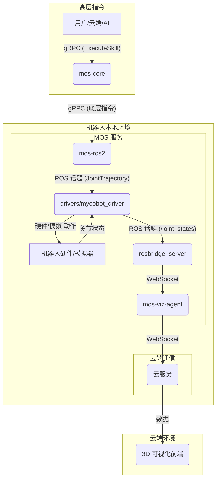

# MOS - Mosia机器人操作系统

MOS 是一个模块化的机器人操作系统，它建立在两大核心原则之上：将软件与特定硬件解耦的**硬件抽象层 (HAL)**，以及使用 WebAssembly (Wasm) 来编排复杂、可移植行为的强大**技能系统**。该架构旨在将基于 ROS2 的本地机器人控制与云端监控相连接，并为实现AI原生的控制平台铺平道路。

## 当前状态

目前，用于机器人状态可视化的核心数据流已完全正常工作。下一个正在开发的主要组件是 **`mos-cloud-agent`**，它将引入身份管理、增强的云服务集成和网络安全功能。

## 架构总览

MOS 架构以 `mos-core` 为中心，它作为系统的“大脑”，负责编排技能和指令，并通过 gRPC、ROS 消息和 WebSocket 与其他服务通信。

### 机器人本地数据流

**1. 基于技能的指令流程:**
1.  一个高层指令可以源自用户、云服务或未来的AI模块。这个指令不是一个简单的关节移动，而是调用一个**技能**（例如 `pick_up_object.wasm`），通过 gRPC 发送给 `mos-core`。
2.  `mos-core` 接收到请求。其内置的**技能系统**会加载并执行指定的 Wasm 模块。
3.  Wasm 技能包包含了任务所需的复杂逻辑。它在一个安全的沙箱中运行，并生成一系列更简单的底层指令（例如，一连串的关节目标点）。
4.  `mos-core` 通过 gRPC 将这些底层指令发送给 `mos-ros2`。
5.  从这里开始，流程与之前相同：`mos-ros2` 将指令转换为 ROS 消息，`drivers` 节点执行它们，机器人随之运动。

**2. 状态发布与可视化流程:**
此流程保持不变。`drivers` 节点将机器人的状态发布到 `/joint_states`，这些数据随后由 `rosbridge` 和 `mos-viz-agent` 中继到云端，用于实时3D可视化。

## 组件说明

-   **`mos-core`**: 操作系统的“大脑”。它内置了**技能系统**，该系统使用 WebAssembly (`Wasm`) 运行时来执行复杂的、沙箱化的行为。开发者可以创建技能（例如，用于运动规划、计算机视觉任务），将其编译为 Wasm，然后部署到机器人上。`mos-core` 负责编排这些技能，并将其输出转换为底层指令。
-   **`mos-ros2`**: 一个感知 ROS2 的服务，充当桥梁的角色。它运行一个 gRPC 服务器，用于接收来自 `mos-core` 的底层指令，并将其作为 ROS 消息发布给驱动节点。
-   **`drivers`**: 此目录是 MOS 生态系统的**硬件抽象层 (HAL)**。它包含特定机器人的驱动实现（例如 `mycobot_driver.py`）。每个驱动程序都订阅标准化的 ROS 指令话题，并将其转换为其对应硬件的特定协议。通过将所有硬件相关的代码隔离在此处，MOS 堆栈的其余部分（如 `mos-core` 和技能系统）保持完全的硬件无关性，从而实现了真正的软硬件分离。
-   **`mos-viz-agent`**: 一个微服务，作为连接本地 ROS 环境与云端的桥梁，用于数据可视化。
-   **`mos-cloud-agent`**: (开发中) 一个规划中的微服务，用于处理稳健的云端交互、身份验证和安全等。

## 未来愿景：迈向 AI 原生的机器人平台

MOS 的目标是超越一个简单的指令控制系统，进化为一个功能完备的、AI原生的机器人平台。技能系统是实现这一愿景的关键。

**1. AI 作为终极技能编排师:**
未来，触发技能的将不再是人类，而是一个“大师AI”。这个AI将作为中央大脑，做出高层决策。例如，用户可以用自然语言下达指令：“帮我从厨房拿个水瓶。”
-   一个与 MOS 集成的**大语言模型 (LLM)** 将解析此命令。
-   一个**规划AI**会将任务分解为一连串的技能序列：`navigate("kitchen").wasm` -> `find_object("bottle").wasm` -> `pick_up_object.wasm` -> `navigate("user_location").wasm` -> `place_object.wasm`。
-   AI随后将指令 `mos-core` 按顺序执行这个技能序列。

**2. 自我学习的生态系统:**
平台将不仅仅执行预定义的技能，它还能学习新技能。通过在云端模拟环境中进行**强化学习 (RL)**，AI可以为复杂问题发现创新的解决方案（例如，学习如何优雅地打开一个抽屉）。一旦策略学习完成，它可以被编译成一个全新的、高度优化的 Wasm 技能，并部署到整个机器人舰队。技能系统成为了分发“习得智能”的媒介。

**3. 实时感知与适应:**
AI将与实时感知系统（如摄像头、激光雷达）相连。这使得技能能够变得动态和反应灵敏。一个 `pick_up_object.wasm` 技能将不再是执行一段盲目的轨迹，而是会从视觉AI那里接收实时的坐标，使其能够适应被移动过的物体或避开预料之外的障碍。

在这样的未来中，AI 提供**“做什么”**（目标），而 Wasm 技能则提供安全、高效和可移植的**“如何做”**（执行）。MOS 将成为连接抽象智能与真实世界物理动作的无缝桥梁。
