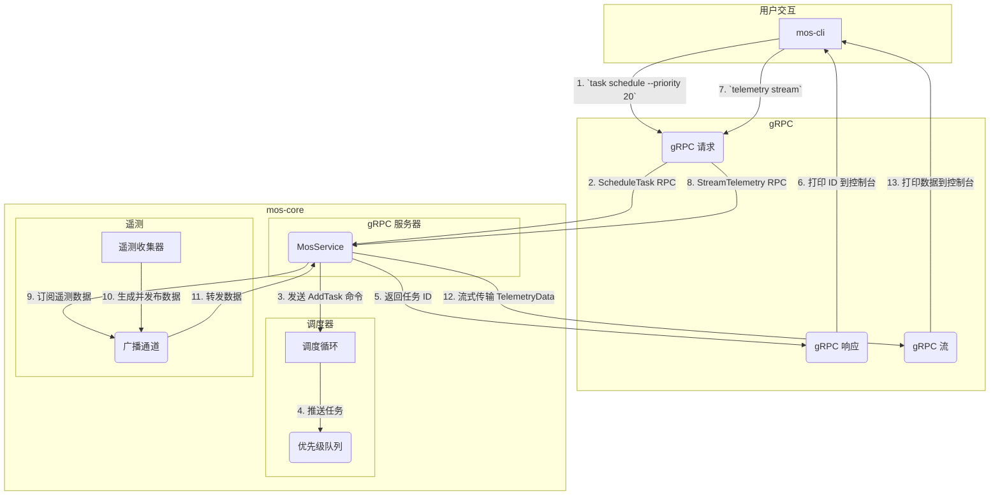

# Mos：模块化操作系统内核

`mos`是一个用 Rust 编写的现代模块化操作系统内核的概念验证项目，专为管理任务、收集遥测数据以及为机器人、物联网或其他嵌入式应用提供高度可扩展的“技能”系统而设计。
该系统采用类似微内核的架构，其中核心的`mos-core`服务管理系统资源，并通过 gRPC API 安全地暴露其功能。

# 核心功能
- **异步任务调度**：基于优先级的调度器，用于管理和执行并发任务。
- **gRPC 接口**：所有核心功能通过使用 Protobuf 定义的强类型 gRPC API 暴露。
- **实时遥测流**：用于收集和观察实时系统数据的双向流式 API。
- **可扩展的技能系统**：支持可加载模块（技能），并为基于 wasmtime 的 WebAssembly（WASM）运行时奠定了基础。
- **硬件抽象层（HAL）**：基于 trait 的方法，将核心逻辑与特定硬件驱动程序解耦。
- **清晰的模块化架构**：通过 Cargo 工作空间组织，核心库、CLI 客户端和 SDK 之间职责清晰分离。

# 架构概览
`mos`项目是一个 Cargo 工作空间，由四个主要 crate 组成：
- **`mos-core`**: 系统的核心。作为长期运行的服务器进程，管理任务调度器、遥测收集器和技能运行时，并实现 gRPC API 的服务器端逻辑。
- **`mos-cli`**: 命令行界面（CLI），作为`mos-core`服务的远程控制工具，是一个 gRPC 客户端，允许用户调度任务、流式传输遥测数据并与系统交互。
- **`mos-sdk`**: 软件开发工具包（SDK），为希望为`mos`生态系统开发应用程序或技能的开发者提供必要的 gRPC 客户端存根和数据类型。
- **`mos-macros`**: 一个过程宏库，旨在简化技能开发。例如，`#[mos_skill]` 宏可以自动生成技能注册和通信的样板代码。

# 架构流程图
下图展示了两个主要工作流程：任务调度和遥测流。

**图表说明**
1.  **任务调度**:用户运行`mos-cli task schedule`，CLI 通过 gRPC 发送 `ScheduleTask` 请求到`mos-core`的 `MosService`。服务生成一个唯一 ID，将 `AddTask` 命令发送到调度器的命令通道，并立即将新任务 ID 返回给 CLI。调度循环接收命令并将任务推送到优先级队列以供后续执行。
2.  **遥测流**:用户运行`mos-cli telemetry stream`，CLI 发起一个 `StreamTelemetry` 双向 gRPC 流。`MosService`订阅`tokio::sync::broadcast`通道。与此同时，`TelemetryCollector` 在单独的异步任务中运行，定期生成模拟数据并发布到广播通道。`MosService` 接收这些数据并通过 gRPC 流转发给 CLI，CLI 将其打印到控制台。

## 快速开始
### 前提条件
- [Rust工具链](https://www.rust-lang.org/tools/install)（建议使用最新稳定版本）。

### 1. 构建项目
克隆仓库并使用 Cargo 构建整个工作空间。这将编译所有 crate 并处理依赖项。
```bash
# 进入项目根目录
cd /Users/mofan/Robot/mos
# 构建整个项目
cargo build
```

### 2. 运行核心服务打开一个终端并运行 mos-core 可执行文件。这将启动 gRPC 服务器，监听传入请求。
```bash
# 从项目根目录
cargo run -p mos-core
# 预期输出：
# INFO  mos_core] gRPC 服务器监听在 [::1]:50051
# INFO  mos_core::scheduler::scheduler] 调度器正在运行。
# INFO  mos_core::telemetry::collector] 遥测收集器正在运行。
```
### 3. 使用 CLI
打开**第二个终端**，使用`mos-cli`与服务交互。
**调度新任务:**
```bash
# 从项目根目录
cargo run -p mos-cli -- task schedule --priority 20
# 预期输出：
# 成功调度任务，ID 为：1
```
在`mos-core`终端中，你将看到相应的日志：
`INFO  mos_core::grpc::server] Received schedule_task request: Task { id: 1, priority: 20, state: Pending }`

**遥测数据串流:**
```bash
# 从项目根目录
cargo run -p mos-cli -- telemetry stream
# 预期输出（数据将持续流式传输）：
# 接收遥测数据（按 Ctrl+C 停止）：
# [2025-10-10T12:00:01Z] 来源：mock_sensor，值：0.9511，时间戳：1760000001
# [2025-10-10T12:00:02Z] 来源：mock_sensor，值：0.9987，时间戳：1760000002
# ...
```

## 模块深入解析
- **调度器**：位于 `mos-core/src/scheduler`，使用 `tokio::sync::mpsc` 通道接收命令，并使用 `std::collections::BinaryHeap` 作为任务的优先级队列。
- **技能系统与WASM**：在 `mos-core/src/skill` 中奠定了基础，使用 `wasmtime` 提供沙盒化的 `WebAssembly` 模块运行时。API 围绕 `Skill trait` 设计，支持不同类型的技能（例如，原生 Rust 技能或 WASM 技能）。
- **gRPC API**：API 在 `mos-core/proto/mos.proto` 中定义，指定了两个主要 RPC：`ScheduleTask`（一元调用）和 `StreamTelemetry`（双向流）。

## 未来工作
该项目为未来开发奠定了坚实基础。可能的增强包括：
- **完整技能执行**：实现调度器从队列中取出任务并执行的逻辑（例如，调用 `Skill::call` 方法）。
- **WASM 技能加载**：实现从磁盘加载 `.wasm` 文件并将其注册为 `WasmSkill` 的机制。
- **资源管理**：将 `ResourceManager` 与调度器集成，确保任务可以安全地获取和释放共享资源（例如，硬件）的锁。
- **OTA 实现**：完善空中更新（OTA）代理，以执行真正的更新检查和应用。

