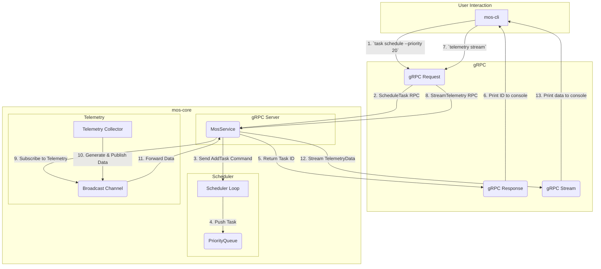

# Mos: A Modular Operating System Core

`mos` is a proof-of-concept project demonstrating a modern, modular operating system core written in Rust. It is designed for managing tasks, collecting telemetry, and providing a highly extensible "skill" system for robotics, IoT, or other embedded applications.

The system is built as a microkernel-like architecture, where a central `mos-core` service manages system resources and exposes its functionality securely via a gRPC API.

## Core Features

- **Asynchronous Task Scheduling**: A priority-based scheduler for managing and executing concurrent tasks.
- **gRPC Interface**: All core functionalities are exposed through a robust, strongly-typed gRPC API defined with Protobuf.
- **Real-time Telemetry Streaming**: A bidirectional streaming API for collecting and observing real-time system data.
- **Extensible Skill System**: Designed to support loadable modules (skills), with a foundation for a WebAssembly (WASM) runtime using `wasmtime`.
- **Hardware Abstraction Layer (HAL)**: A trait-based approach to decouple core logic from specific hardware drivers.
- **Clean, Modular Architecture**: Organized as a Cargo Workspace with clear separation of concerns between the core library, CLI client, and SDK.

## Architecture Overview

The `mos` project is a Cargo workspace composed of four main crates:

- **`mos-core`**: The heart of the system. It runs as a long-lived server process, managing the task scheduler, telemetry collector, and skill runtime. It implements the server-side logic for the gRPC API.
- **`mos-cli`**: A command-line interface (CLI) that acts as a remote control for the `mos-core` service. It is a gRPC client that allows users to schedule tasks, stream telemetry, and interact with the system.
- **`mos-sdk`**: A Software Development Kit (SDK) intended for developers who want to build applications or skills for the `mos` ecosystem. It provides the necessary gRPC client stubs and data types to communicate with `mos-core`.
- **`mos-macros`**: A procedural macro library designed to simplify skill development. For example, a `#[mos_skill]` macro could automate boilerplate code for skill registration and communication.

### Architectural Flow Diagram

This diagram illustrates the two main workflows: scheduling a task and streaming telemetry.



**Diagram Explanation:**

1.  **Task Scheduling**: A user runs `mos-cli task schedule`. The CLI sends a `ScheduleTask` gRPC request to the `MosService` in `mos-core`. The service generates a unique ID, sends an `AddTask` command to the scheduler's command channel, and immediately returns the new task ID to the CLI. The scheduler loop picks up the command and pushes the task into its priority queue for future execution.

2.  **Telemetry Streaming**: A user runs `mos-cli telemetry stream`. The CLI initiates a `StreamTelemetry` bidirectional gRPC stream. The `MosService` subscribes to a `tokio::sync::broadcast` channel. In parallel, the `TelemetryCollector` runs in a separate async task, periodically generating mock data and publishing it to the broadcast channel. The `MosService` receives this data and forwards it over the gRPC stream to the CLI, which prints it to the console.

## Quick Start

### Prerequisites

- [Rust Toolchain](https://www.rust-lang.org/tools/install) (latest stable version recommended).

### 1. Build the Project

Clone the repository and use Cargo to build the entire workspace. This will compile all crates and handle dependencies.

```bash
# Navigate to the project root directory
cd /Users/mofan/Robot/mos

# Build the entire project
cargo build
```

### 2. Run the Core Service

Open a terminal and run the `mos-core` binary. This will start the gRPC server, which will listen for incoming requests.

```bash
# From the project root
cargo run -p mos-core

# You should see output like:
# INFO  mos_core] gRPC server listening on [::1]:50051
# INFO  mos_core::scheduler::scheduler] Scheduler is running.
# INFO  mos_core::telemetry::collector] Telemetry collector is running.
```

### 3. Use the CLI

Open a **second terminal** to interact with the service using `mos-cli`.

**Schedule a new task:**

```bash
# From the project root
cargo run -p mos-cli -- task schedule --priority 20

# Expected output:
# Successfully scheduled task with ID: 1
```

In the `mos-core` terminal, you will see the corresponding log:
`INFO  mos_core::grpc::server] Received schedule_task request: Task { id: 1, priority: 20, state: Pending }`

**Stream telemetry data:**

```bash
# From the project root
cargo run -p mos-cli -- telemetry stream

# Expected output (data will stream continuously):
# Receiving telemetry data (Press Ctrl+C to stop):
# [2025-10-10T12:00:01Z] Source: mock_sensor, Value: 0.9511, Timestamp: 1760000001
# [2025-10-10T12:00:02Z] Source: mock_sensor, Value: 0.9987, Timestamp: 1760000002
# ...
```

## Module Deep Dive

- **Scheduler**: Implemented in `mos-core/src/scheduler`, it uses a `tokio::sync::mpsc` channel to receive commands and a `std::collections::BinaryHeap` to act as a priority queue for tasks.
- **Skill System & WASM**: The foundation is laid in `mos-core/src/skill`. It uses `wasmtime` to provide a runtime for executing sandboxed WebAssembly modules. The API is designed around a `Skill` trait, allowing for different kinds of skills (e.g., native Rust skills or WASM skills).
- **gRPC API**: The API contract is defined in `mos-core/proto/mos.proto`. It specifies two main RPCs: `ScheduleTask` (unary) and `StreamTelemetry` (bidirectional streaming).

## Future Work

This project serves as a strong foundation. Future enhancements could include:

- **Full Skill Execution**: Implement the logic for the scheduler to actually pop tasks from the queue and execute them (e.g., call the `Skill::call` method).
- **WASM Skill Loading**: Implement a mechanism to load `.wasm` files from disk and register them as `WasmSkill`s with the scheduler.
- **Resource Management**: Integrate the `ResourceManager` with the scheduler to ensure tasks can safely acquire and release locks on shared resources (e.g., hardware).
- **OTA Implementation**: Flesh out the Over-the-Air update agent to perform real update checks and apply them.
