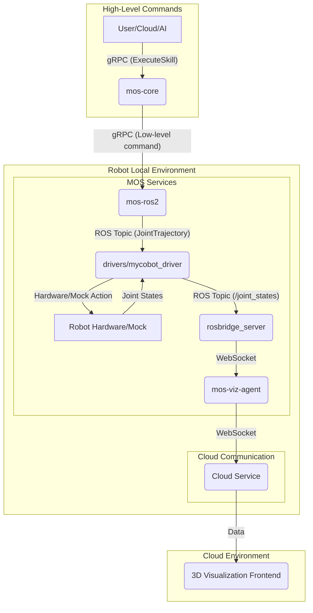

# MOS - A Modular Robot Operation System

MOS is a modular robotics operation system built on two core principles: a **Hardware Abstraction Layer (HAL)** that decouples software from specific hardware, and a powerful **Skill System** using WebAssembly (Wasm) to orchestrate complex, portable behaviors. This architecture is designed to bridge local ROS2-based robot control with cloud-based monitoring and paves the way for an AI-native control platform.

## Current Status

The core data flow for robot state visualization is fully functional. The next major component under development is the **`mos-cloud-agent`**, which will introduce identity management, enhanced cloud service integration, and network security.

## Architecture Overview

The MOS architecture is centered around `mos-core`, which acts as the brain of the system, orchestrating skills and commands. It communicates with other services via gRPC, ROS messages, and WebSockets.

### On-Robot Data Flow

**1. The Skill-Based Command Flow:**
1.  A high-level command originates from a user, a cloud service, or a future AI module. This command is not a simple joint movement but a call to execute a **Skill** (e.g., `pick_up_object.wasm`), sent via gRPC to `mos-core`.
2.  `mos-core` receives the request. Its **Skill System** loads and executes the specified Wasm module.
3.  The Wasm skill contains the complex logic for the task. It runs in a secure sandbox and generates a sequence of simpler, low-level commands (e.g., a series of joint targets).
4.  `mos-core` sends these low-level commands via gRPC to `mos-ros2`.
5.  From here, the flow continues as before: `mos-ros2` translates the commands into ROS messages, the `drivers` node executes them, and the robot moves.

**2. State Publishing & Visualization Flow:**
This flow remains the same. The `drivers` node publishes the robot's state to `/joint_states`, which is then relayed by `rosbridge` and `mos-viz-agent` to the cloud for real-time 3D visualization.

## Components

-   **`mos-core`**: The brain of the operation. It houses the **Skill System**, which uses a WebAssembly (`Wasm`) runtime to execute complex, sandboxed behaviors. Developers can create skills (e.g., for motion planning, computer vision tasks), compile them to Wasm, and deploy them to the robot. `mos-core` orchestrates these skills and translates their output into low-level commands.
-   **`mos-ros2`**: A ROS2-aware service that acts as a bridge. It runs a gRPC server to receive low-level commands from `mos-core` and publishes them as ROS messages for the driver nodes.
-   **`drivers`**: This directory acts as the **Hardware Abstraction Layer (HAL)** for the MOS ecosystem. It contains robot-specific driver implementations (e.g., `mycobot_driver.py`). Each driver subscribes to the standardized ROS command topics and translates them into the specific protocol for its hardware. By isolating all hardware-dependent code here, the rest of the MOS stack (like `mos-core` and the Skill System) remains completely hardware-agnostic, achieving a true separation of software and hardware.
-   **`mos-viz-agent`**: A microservice that bridges the local ROS world with the cloud for visualization.
-   **`mos-cloud-agent`**: (Under Development) A planned microservice for robust cloud interactions, authentication, and security.

## Future Vision: Towards an AI-Native Robotics Platform

MOS aims to evolve beyond a simple command-and-control system into a fully-fledged, AI-native robotics platform. The Skill System is the key to this vision.

**1. AI as the Ultimate Skill Composer:**
Instead of a human triggering a skill, a master AI will orchestrate them. This AI will act as the central brain, making high-level decisions. For example, a user could give a natural language command like, "Get me the water bottle from the kitchen."
-   An **LLM (Large Language Model)** integrated with MOS would parse this command.
-   A **Planning AI** would decompose the task into a sequence of skills: `navigate("kitchen").wasm` -> `find_object("bottle").wasm` -> `pick_up_object.wasm` -> `navigate("user_location").wasm` -> `place_object.wasm`.
-   The AI would then command `mos-core` to execute this skill sequence.

**2. A Self-Learning Ecosystem:**
The platform will not just execute predefined skills; it will learn new ones. Using **Reinforcement Learning (RL)** in cloud-based simulations, the AI can discover novel solutions to complex problems (e.g., learning to gracefully open a drawer). Once a policy is learned, it can be compiled into a new, highly-optimized Wasm skill and deployed to the entire fleet of robots. The Skill System becomes a medium for distributing learned intelligence.

**3. Real-time Perception and Adaptation:**
The AI will be connected to a real-time perception system (e.g., cameras, LiDAR). This allows skills to be dynamic and reactive. A `pick_up_object.wasm` skill won't just execute a blind trajectory; it will receive real-time coordinates from a vision AI, allowing it to adapt to objects that have been moved or to avoid unexpected obstacles.

In this future, the AI provides the **"what"** (the goal), and the Wasm skills provide a safe, efficient, and portable **"how"** (the execution). MOS will become a seamless bridge between abstract intelligence and real-world physical action.
